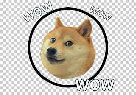

# 👾 Are We Alone? 👾

This is a photo from the <a href="https://webb.nasa.gov/"> James Webb Space Telescope.</a> Every bright spot is <a href="https://physics.stackexchange.com/questions/160283/are-we-seeing-the-past-when-we-look-at-the-stars"> a galaxy, not a star!</a> Each galaxy has billions of stars. You are also looking into the past when you star at stars. This image shows galaxies from the start of our universe.

## ⭐ Fermi Paradox ⭐

The Fermi Paradox addresses the question: why do we seem alone in the universe? Scientists believe there are billions of stars in our galaxy, many of which could harbor Earth-like planets. With the vast number of possibilities, it seems probable that other intelligent life would exist. Yet, the mystery remains: if there are numerous potential alien civilizations, why haven't we detected any signs of them? Why is the universe so silent?

The Fermi Paradox describes the contradiction between the high likelihood of extraterrestrial civilizations existing and our absence of evidence or contact with these civilizations.

Consider a model for the Fermi Paradox to simulate varying scenarios:

Turn this Equation Into A function

## 👩‍🍳 Functions & Arguments 🍎🥦

Functions and arguments go hand in hand! 🤝 Think of a function as a chef 👩‍🍳 and arguments as the ingredients. You provide the ingredients to the chef, and she whips up a delightful dish! 🍲

👩‍🍳 Functions Explained 👩‍🍳

A function operates like a mini-program within your main program. It allows you to bundle code, assign it a name, and utilize it multiple times. Visualize a magic box 🎁 that performs a task every time you invoke it.

<pre><code>
def greet():
    print("Hello, world!")
greet()  # This will display "Hello, world!"
</code></pre>

🍎🥦 Understanding Arguments 🍎🥦

Arguments are the special instructions 💌 you send to your function. Think of them as the specific ingredients 🍎🥦 you add to a recipe. The function processes these ingredients to produce a result.

<pre><code>
def greet(name):
    print(f"Hello, {name}!")
</code></pre>

---

## Scope 🌌

🌠What is Scope? ğŸŒ

Scope acts as an invisible barrier ⛩️ around segments of your code. Variables (like `x = 5`) exist within these boundaries. Python defines scope with indents (tabs).

Imagine you have a toy box 🧸 in your room. Toys inside the box can't be seen or played with by someone in the living room. Similarly, variables inside a function can't be accessed or modified by code outside the function.

<pre><code>
def my_function():
    secret_variable = "You can't see me outside the function!"
print(secret_variable)  # This will give an error! 😱
</code></pre>

But don't fret! There are ways to share variables between different parts of your code. But that's a tale for another time! 😉

How do functions and arguments work together? 🤖

You invoke functions and supply them with arguments.

<pre><code>
def make_sandwich(bread, filling):
    print(f"Here's a {filling} sandwich with {bread} bread!")
make_sandwich("whole grain", "turkey")  # This will print "Here's a turkey sandwich with whole grain bread!"
</code></pre>

